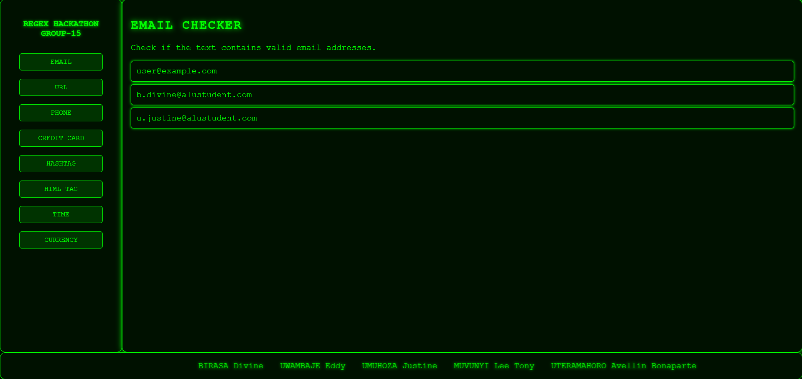

# Group-15 REGEX Hackathon

Welcome to the Group-15 REGEX Hackathon project! This project showcases various regular expression (regex) utilities for different types of data validation and extraction. The project includes a web interface that allows users to test and visualize the regex functionalities.

## Demo


## Table of Contents

- [Introduction](#introduction)
- [Features](#features)
- [Installation](#installation)
- [Usage](#usage)
- [Contributors](#contributors)
- [License](#license)

## Introduction

This project was developed as part of a hackathon by Group-15. It provides a set of regex utilities to validate and extract information such as email addresses, URLs, phone numbers, credit card numbers, hashtags, HTML tags, time, and currency formats.

## Features

- **Email Validation**: Check if a string is a valid email address.
- **URL Validation**: Check if a string is a valid URL.
- **Phone Number Validation**: Check if a string is a valid phone number.
- **Credit Card Validation**: Check if a string is a valid credit card number.
- **Hashtag Extraction**: Extract hashtags from a string.
- **HTML Tag Extraction**: Extract HTML tags from a string.
- **Time Validation**: Check if a string is a valid time format.
- **Currency Validation**: Check if a string is a valid currency format.

## Installation

To run this project locally, follow these steps:

1. Clone the repository:
    ```sh
    git clone https://github.com/yourusername/group-15-regex-hackathon.git
    ```
2. Navigate to the project directory:
    ```sh
    cd group-15-regex-hackathon
    ```
3. Open `index.html` in your preferred web browser.

## Usage

1. Open the `index.html` file in your web browser.
2. Use the buttons on the right sidebar to select the type of validation or extraction you want to perform.
3. The results will be displayed in the content area.

## Contributors

This project was developed by the following members of Group-15:

- BIRASA Divine
- UWAMBAJE Eddy
- UMUHOZA Justine
- MUVUNYI Lee Tony
- UTERAMAHORO Avellin Bonaparte

## License

This project is licensed under the MIT License. See the [LICENSE](LICENSE) file for more details.